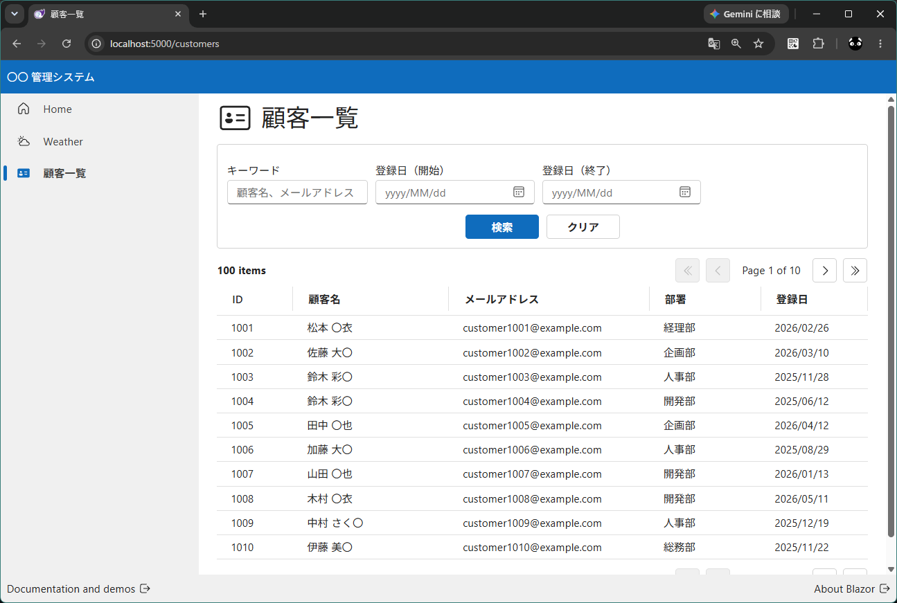

# dotnet_fluent_ui_blazor_v5_study2

## 概要

* Fluent UI Blazor v5 を試す
* [dotnet_fluent_ui_blazor_v5_study1](https://github.com/Tobotobo/dotnet_fluent_ui_blazor_v5_study1) の続き
* Static SSR で顧客一覧検索を動かす

### 参照
* https://v5.fluentui-blazor.net/



## 詳細

```sh
> dotnet --version
10.0.302
```

https://www.nuget.org/packages/Microsoft.FluentUI.AspNetCore.Templates/5.0.0-rc.5-26219.1

```bash
dotnet new install Microsoft.FluentUI.AspNetCore.Templates@5.0.0-rc.5-26219.1
```

```bash
dotnet new fluentblazor --interactivity None --no-https false -n DotnetStudy
```

```bash
dotnet run --project DotnetStudy
dotnet watch --project DotnetStudy
```


### dotnet new fluentblazor --help

```sh
> dotnet new fluentblazor --help
Fluent Blazor Web アプリ (C#)
作成者: Microsoft
説明: サーバー側のレンダリングとクライアントの対話機能の両方をサポートする Blazor Web アプリを作成するためのプロジェクト テンプレートです。このテンプレートは、リッチな動的ユーザー インターフェイス (UI) を持つ Web アプリに使用できます。
このテンプレートには、Microsoft 以外のパーティのテクノロジーが含まれています。詳しくは、https://aka.ms/aspnetcore/10.0-third-party-notices をご覧ください。

使用法:
  dotnet new fluentblazor [options] [テンプレート オプション]

オプション:
  -n, --name <name>       作成される出力の名前です。名前を指定しない場合は、出力ディレクトリの名前が使用されます。
  -o, --output <output>   生成された出力を配置する場所。
  --dry-run               指定されたコマンドラインがテンプレートを実行した場合に発生する結果の概要を表示します。 [default: False]
  --force                 既存のファイルが変更された場合でも、コンテンツを強制的に生成します。 [default: False]
  --no-update-check       テンプレートをインスタンス化する場合に、テンプレート パッケージの更新の確認を無効にします。 [default: False]
  --project <project>     コンテキストの評価に使用する必要があるプロジェクトです。
  -lang, --language <C#>  テンプレート言語を指定してインスタンスを作成します。
  --type <project>        テンプレートの種類を指定してインスタンスを作成します。

テンプレート オプション:
  -f, --framework <net10.0|net9.0>                      プロジェクトのターゲット フレームワークです。
                                                        種類: choice
                                                          net10.0  ターゲット net10.0
                                                          net9.0   ターゲット net9.0
                                                        既定: net10.0
  --no-restore                                          指定した場合、作成時にプロジェクトの自動復元がスキップされます。
                                                        種類: bool
                                                        既定: false
  --exclude-launch-settings                             生成されたテンプレートから launchSettings.json を除外するかどうか。
                                                        種類: bool
                                                        既定: false
  -int, --interactivity <Auto|None|Server|WebAssembly>  対話型コンポーネントに使用する対話型レンダリング モードを選択します
                                                        種類: choice
                                                          None         インタラクティビティなし (静的サーバー レンダリングのみ)
                                                          Server       サーバーで実行
                                                          WebAssembly  WebAssembly を使用してブラウザーで実行します
                                                          Auto         WebAssembly 資産のダウンロード中にサーバーを使用してから、WebAssembly を使用します
                                                        既定: Server
  -e, --empty                                           基本的な使用パターンを示すサンプル ページとスタイルを省略するかどうかを構成します。
                                                        種類: bool
                                                        既定: false
  -au, --auth <Individual|None>                         使用する認証の種類
                                                        種類: choice
                                                          None        認証なし
                                                          Individual  個別の認証
                                                        既定: None
  -uld, --use-local-db                                  SQLite の代わりに LocalDB を使用するかどうか。このオプションは、--auth Individual が指定されている場合にのみ適用されます。
                                                        種類: bool
                                                        既定: false
  -ai, --all-interactive                                最上位レベルで対話型レンダリング モードを適用して、すべてのページを対話型にするかどうかを構成します。false の場合、ページは既定で静的サーバー 
                                                        レンダリングを使用し、ページ単位またはコンポーネント単位で対話型としてマークできます。
                                                        有効な場合: (InteractivityPlatform != "None")
                                                        種類: bool
                                                        既定: false
  --no-https                                            HTTPS をオフにするかどうか。このオプションは、Individual が --auth に使用されていない場合にのみ適用されます。
                                                        種類: bool
                                                        既定: false
  --use-program-main                                    最上位レベルのステートメントではなく、明示的な Program クラスと Main メソッドを生成するかどうか。
                                                        種類: bool
                                                        既定: false
  --localhost-tld                                       ローカル開発用のアプリケーション URL 内で、プロジェクト名を .dev.localhost TLD と組み合わせるかどうか (例: https://myapp.dev.localhost:12345)。
                                                        種類: bool
                                                        既定: false
```

### lang を ja に変更

DotnetStudy/Components/App.razor
```html
<html lang="ja">
```

### テーマをライトテーマに固定

DotnetStudy/wwwroot/app.css
```html
<body data-theme="light">
```

### `nav` を `nav.fluent-nav` に変更

※`FluentPaginator` の内部の `nav` にも適用され高さがおかしくなるため（たぶんいずれ修正される）

DotnetStudy/wwwroot/app.css
```css
nav.fluent-nav {
  align-self: stretch;
  height: calc(100dvh - 80px) !important;
  display: flex;
}
```

### [dotnet_fluent_ui_blazor_v5_study1](https://github.com/Tobotobo/dotnet_fluent_ui_blazor_v5_study1) の Customers をそのまま移植した直後の問題

* メニューから顧客一覧をクリックして、ページが表示までに数秒かかる
  * ページ表示時に全件検索結果が表示される仕様で、検索には検証用に 2 秒のウェイトを入れているので恐らくそれによるもの
  * サーバーモードでは非同期実行で読み込み中になってくれたので問題なかった
  * `@attribute [StreamRendering]` の追加で解消（この設定による影響は要調査）

* 検索などのボタンが全て機能しない
  * たぶん Form として必要なことを何もしてないから

* 日付入力でカレンダーが表示されない
  * なぜ？これは Static SSR でも動きそうだが...
  * 以下の注記が関係している？  
    https://v5.fluentui-blazor.net/DateTime  
    > FluentCalendar および FluentDatePicker コンポーネントは、EditForm および FluentEditForm 要素との完全な互換性がまだありません。エラー メッセージ、必須項目メッセージ、検証メッセージなど、一部の機能が欠落しています。


* 読み込み中のグルグルが表示されない
  * `@attribute [StreamRendering]` の追加で解消（この設定による影響は要調査）


## TODO

* `@attribute [StreamRendering]` の追加による影響を調査する